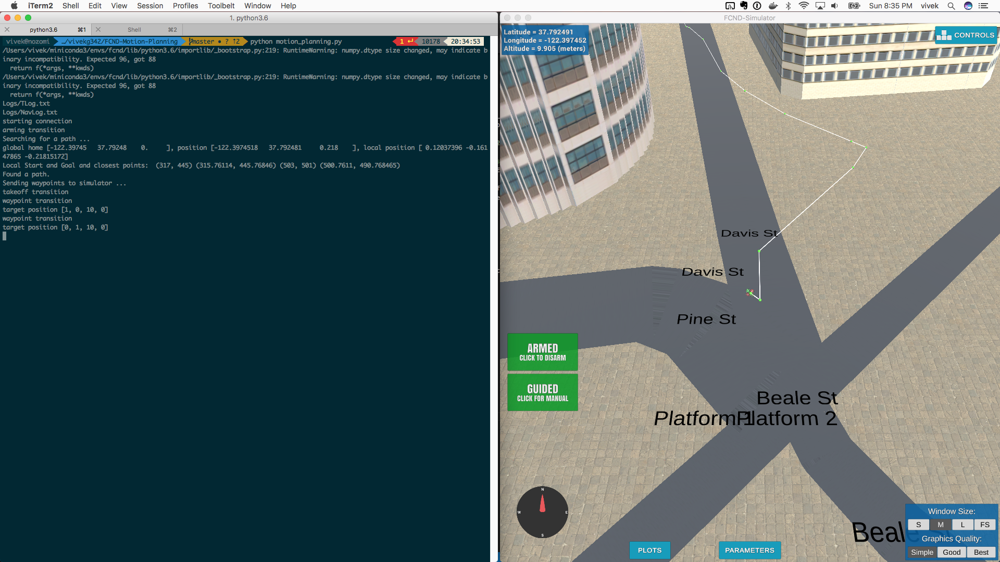
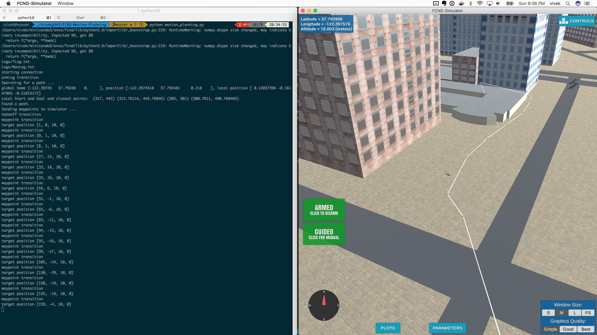

## Project: 3D Motion Planning

### Introduction
This project implements 3D motion planning given a goal position. Current Position will be taken a start position.
Supports two arguments
```
arguments:  
  --goal_position GOAL_POSITION
                        Lon, Lat, Alt: -122.398157,37.792474,0
  --probabilistic_mode PROBABILISTIC_MODE
                        Enable probabilistic mode
```
Sample Executions:

Default mode uses Voronoi:
```
python motion_planning.py --goal_position="-122.398248,37.796342,0"
```
With probabilistic mode(experimental)
```
python motion_planning.py --goal_position="-122.398248,37.796342,0" --probabilistic_mode="True"
```
Some more goal positions are provided in `./motion_plannin.py#240`


### Implementing Your Path Planning Algorithm
1) Set Home Position
This is done in `motion_planning.py`
```
init_pos = self.get_home_coordinates()
self.set_home_position(init_pos[1], init_pos[0], 0)
```

You will find three commits corresponding to 3 different stages.

#### Stage 1
Extending the basic planning implementation provided, path finding works.

- Creates a basic grid
- Given a goal_position it finds a position in the grid based on valid_actions.
- valid actions are determined if the drone is going into a safety_distance of any obstacle.
- Starting with 4 acttions, has been extended to go diagonal
- valid actions are extended to diagonal as well.
These changes are done in `planning_utils_starter.py`

With basic changes, I was able to get it to work by using grids and A*. This creates way too many way points though.


#### Stage 2
Most of these changes are found in `planning_utils.py`

There is a function `create_graph_voronoi` in `planning_utils.py` which accomplishes this.
- Home position is set to current position
- Uses Voronnoi to create a graph
- Uses NetworkX library for efficient queries in A*
- target_altitude is dynamically calculated.
- band_distance varies between final and intermediate waypoints
- also able to land on buildings. (There seems to be some edge cases ?)
- Waypoints will include start and end positions and everything else on graph.
- bresenham is used to cull waypoints

Uses bresenham to cull way points in `planning_utils.py#153`
```
cells = list(bresenham(int(p1[0]), int(p1[1]), int(p2[0]), int(p2[1])))
```




#### Stage 3 (Probabilistic planning - Experimental)
There is a function `create_graph_probabilistic` in `planning_utils.py` which accomplishes this. This seems to work in most cases but sometimes because of possibly incorrect obstacle data and high safety_distance, unable to find a path. Can be enabled with probabilistic_mode="True"